<h2>TensorFlow-FlexUNet-Image-Segmentation-Skin-Cancer  (2026/01/19)</h2>
Sarah T. Arai 
Software Laboratory antillia.com  
This is the first experiment of Image Segmentation for <b>Skin Cancer</b> based on our <a href="./src/TensorFlowFlexUNet.py">TensorFlowFlexUNet</a> 
(TensorFlow Flexible UNet Image Segmentation Model for Multiclass) , 
and  <a href="https://www.kaggle.com/datasets/volodymyrpivoshenko/skin-cancer-lesions-segmentation">Skin Cancer: Lesions Segmentation</a> dataset.
  

<b>Actual Image Segmentation for Skin-Cancer Images of 600x450 pixels</b> 
As shown below, the inferred masks predicted by our segmentation model trained by the dataset appear similar to the ground truth masks, but they lack precision in certain areas.
  
<table>
<tr>
<th>Input: image</th>
<th>Mask (ground_truth)</th>
<th>Prediction: inferred_mask</th>
</tr>
<tr>
<td></td>
<td></td>
<td>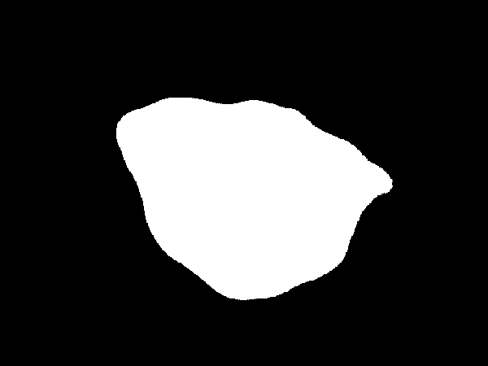</td>
</tr>

<tr>
<td></td>
<td></td>
<td>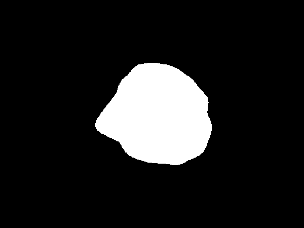</td>
</tr>

<tr>
<td></td>
<td></td>
<td>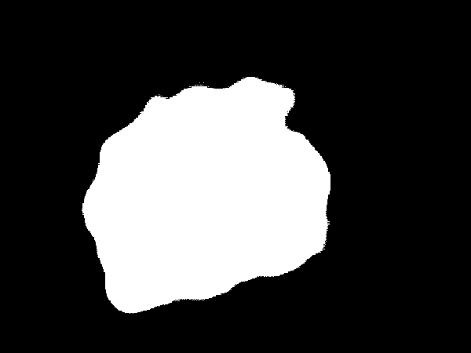</td>
</tr>
</table>

 
<h3>1  Dataset Citation</h3>
The dataset used here was derived from   
<a href="https://www.kaggle.com/datasets/volodymyrpivoshenko/skin-cancer-lesions-segmentation">Skin Cancer: Lesions Segmentation</a> 
HAM10000 multi-source dermatoscopic images of pigmented skin lesions.
  
<b>About Dataset</b> 
Training of neural networks for automated diagnosis of pigmented skin lesions is hampered by the small size and lack of diversity of 
available datasets of dermatoscopic images.  
We tackle this problem by releasing the HAM10000 ("Human Against Machine with 10000 training images") dataset. 
 We collected dermatoscopic images from different populations, acquired and stored by different modalities.
 
The final dataset consists of 10015 dermatoscopic images which can serve as a training set for academic machine learning purposes.
 
Cases include a representative collection of all important diagnostic categories in the realm of pigmented lesions:
 
<ul>
<li><b>AKIEC</b> - actinic keratoses and intraepithelial carcinoma / Bowen's disease</li>
<li><b>BCC</b> - basal cell carcinoma</li>
<li><b>BKL</b> - benign keratosis-like lesions (solar lentigines / seborrheic keratoses and lichen-planus-like keratoses)</li>
<li><b>DF</b> - dermatofibroma</li>
<li><b>MEL</b> - melanoma</li>
<li><b>NV</b> - melanocytic nevi</li>
<li><b>VC</b> - vascular lesions (angiomas, angiokeratomas, pyogenic granulomas and haemorrhage)</li>
</ul>
 
More than 50% of lesions are confirmed through histopathology, the ground truth for the rest of the cases is either follow-up examination (follow_up), 
expert consensus (consensus), or confirmation by in-vivo confocal microscopy (confocal).  
The dataset includes lesions with multiple images, which can be tracked by the lesion_id-column within the metadata file.
  
<b>License</b> 
<a href="https://spdx.org/licenses/CC-BY-NC-4.0.html">Creative Commons Attribution-NonCommercial 4.0 International License</a>
 
 
<h3>
2 Skin-Cancer ImageMask Dataset
</h3>
 If you would like to train this Skin-Cancer Segmentation model by yourself,
please down load master dataset 
<a href="https://www.kaggle.com/datasets/volodymyrpivoshenko/skin-cancer-lesions-segmentation">Skin Cancer: Lesions Segmentation</a>.
 <
We used a Python script <a href="./generator/split_master.py">split_master.py </a>to spit the master dataset into test, train and valid subset. 
<pre>
./dataset
└─Skin-Cancer
    ├─test
    │   ├─images
    │   └─masks
    ├─train
    │   ├─images
    │   └─masks
    └─valid
        ├─images
        └─masks
</pre>
 
<b>Skin-Cancer Statistics</b> 
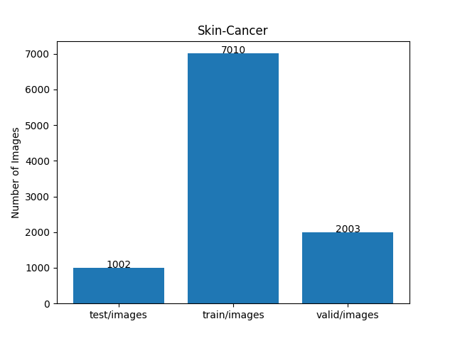 
 
As shown above, the number of images of train and valid datasets is large enough to use for a training set of our segmentation model.
  
<b>Train_images_sample</b> 
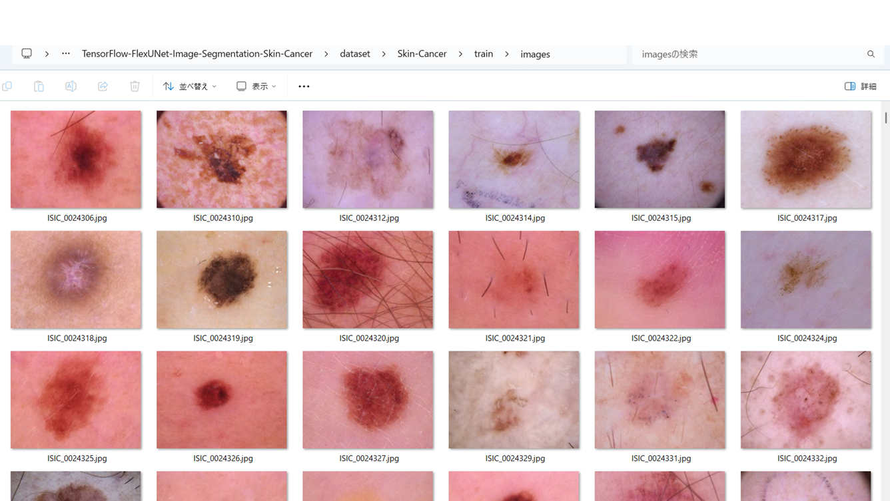
 
<b>Train_masks_sample</b> 
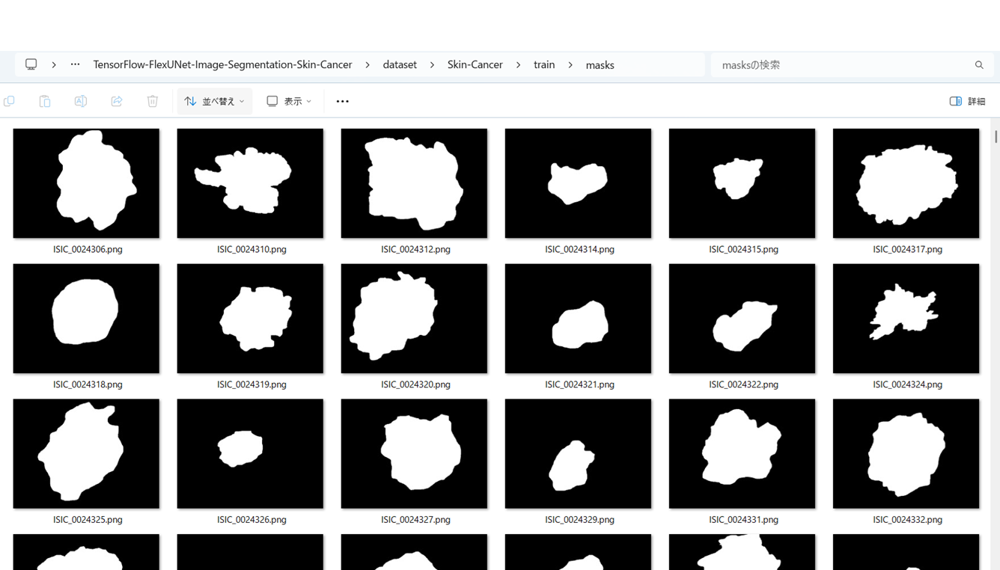
 
<h3>
3 Train TensorflowFlexUNet Model
</h3>
 We trained Skin-Cancer TensorflowFlexUNet Model by using the following
<a href="./projects/TensorFlowFlexUNet/Skin-Cancer/train_eval_infer.config"> <b>train_eval_infer.config</b></a> file.  
Please move to ./projects/TensorFlowFlexUNet/Skin-Cancer and run the following bat file. 
<pre>
>1.train.bat
</pre>
, which simply runs the following command. 
<pre>
>python ../../../src/TensorFlowFlexUNetTrainer.py ./train_eval_infer.config
</pre>

<b>Model parameters</b> 
Defined a small <b>base_filters=16</b> and a large <b>base_kernels=(11,11)</b> for the first Conv Layer of Encoder Block of 
<a href="./src/TensorFlowFlexUNet.py">TensorFlowFlexUNet.py</a> 
and a large num_layers (including a bridge between Encoder and Decoder Blocks).
<pre>
[model]
image_width    = 512
image_height   = 512
image_channels = 3
input_normalize = True
normalization  = False
num_classes    = 2
base_filters   = 16
base_kernels  = (11,11)
num_layers    = 8

dropout_rate   = 0.05
dilation       = (1,1)
</pre>

<b>Learning rate</b> 
Defined a small learning rate.  
<pre>
[model]
learning_rate  = 0.00007
</pre>

<b>Loss and metrics functions</b> 
Specified "categorical_crossentropy" and "dice_coef_multiclass". 
<pre>
[model]
loss           = "categorical_crossentropy"
metrics        = ["dice_coef_multiclass"]
</pre>
<b >Learning rate reducer callback</b> 
Enabled learing_rate_reducer callback, and a small reducer_patience.
<pre> 
[train]
learning_rate_reducer = True
reducer_factor     = 0.5
reducer_patience   = 4
</pre>
<b>Early stopping callback</b> 
Enabled early stopping callback with patience parameter.
<pre>
[train]
patience      = 10
</pre>
<b></b> 
<b>RGB color map</b> 
rgb color map dict for Skin-Cancer 1+1 classes. 
<pre>
[mask]
mask_file_format = ".png"
;Skin-Cancer 1+1
rgb_map = {(0,0,0):0,  (255, 255, 255):1, }       
</pre>
<b>Epoch change inference callbacks</b> 
Enabled epoch_change_infer callback. 
<pre>
[train]
epoch_change_infer       = True
epoch_change_infer_dir   =  "./epoch_change_infer"
epoch_changeinfer        = False
epoch_changeinfer_dir    = "./epoch_changeinfer"
num_infer_images         = 6
</pre>
By using this epoch_change_infer callback, on every epoch_change, the inference procedure can be called
 for 6 images in <b>mini_test</b> folder. This will help you confirm how the predicted mask changes 
 at each epoch during your training process.    
<b>Epoch_change_inference output at starting (1,2,3)</b> 
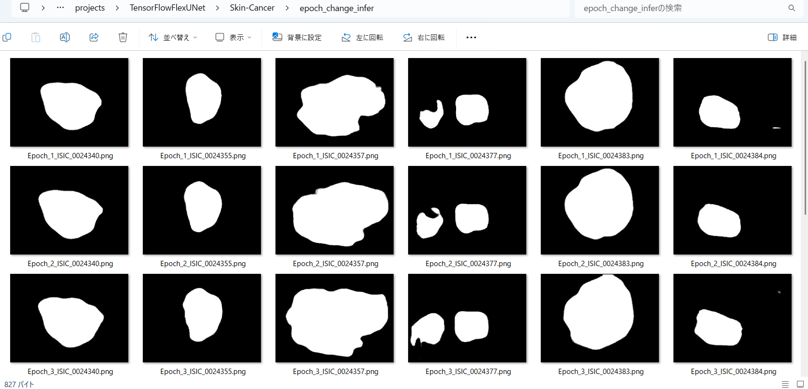 
 
<b>Epoch_change_inference output at ending (11,12,13)</b> 
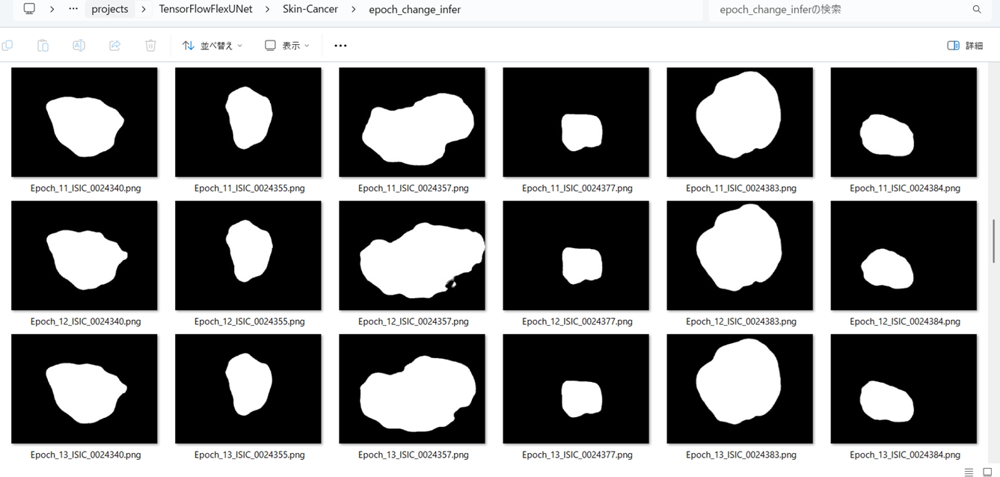 
 
<b>Epoch_change_inference output at ending (24,25,26)</b> 
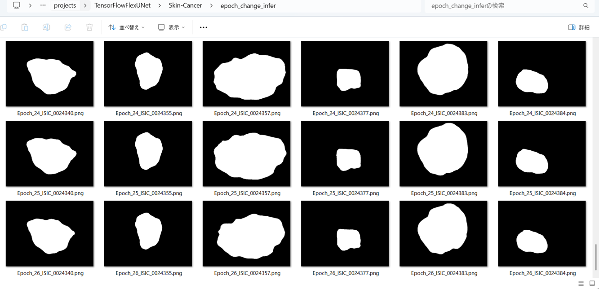 

 
In this experiment, the training process was stoppd at epoch 26 by EarlyStoppingCallback.  
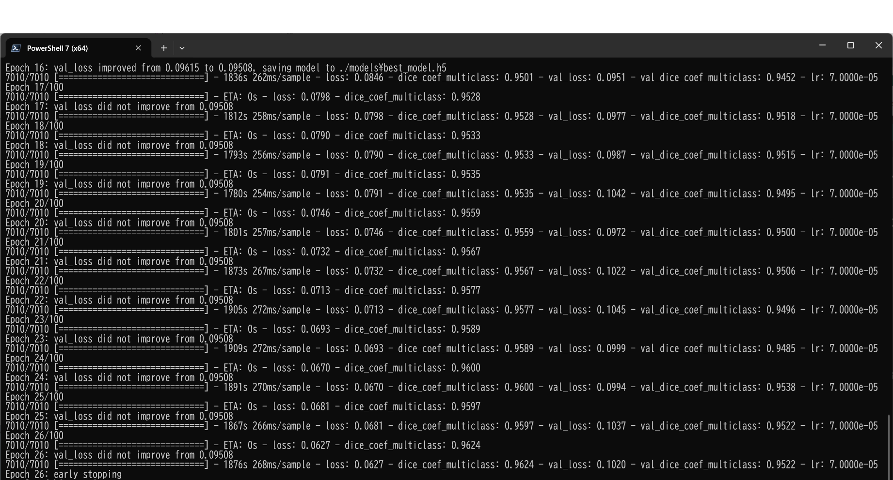 
 
<a href="./projects/TensorFlowFlexUNet/Skin-Cancer/eval/train_metrics.csv">train_metrics.csv</a> 
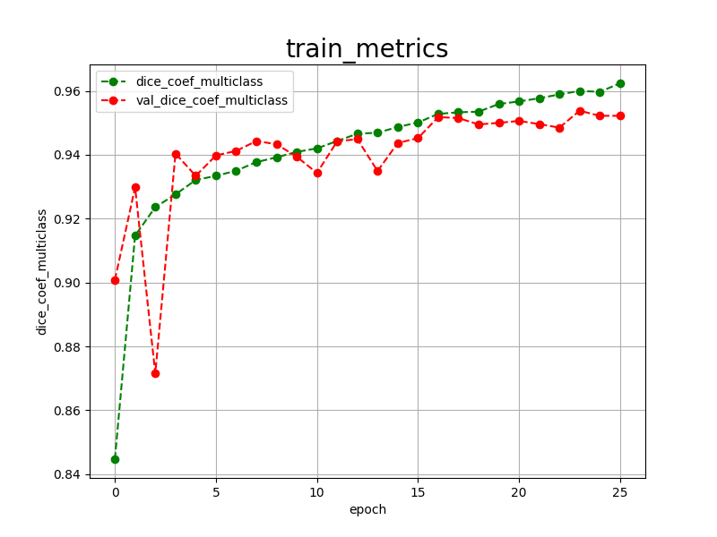 

 
<a href="./projects/TensorFlowFlexUNet/Skin-Cancer/eval/train_losses.csv">train_losses.csv</a> 
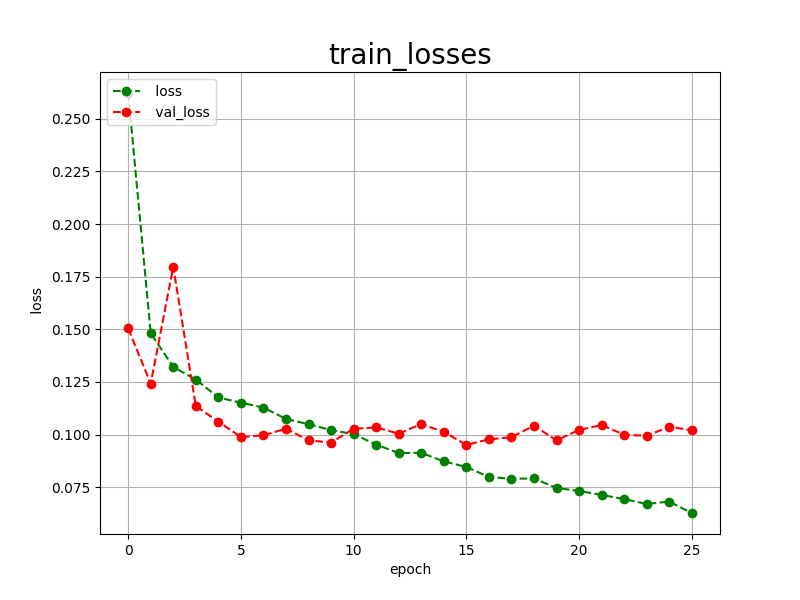 
 
<h3>
4 Evaluation
</h3>
Please move to a <b>./projects/TensorFlowFlexUNet/Skin-Cancer</b> folder, 
and run the following bat file to evaluate TensorflowFlexUNet model for Skin-Cancer. 
<pre>
>./2.evaluate.bat
</pre>
This bat file simply runs the following command.
<pre>
>python ../../../src/TensorFlowFlexUNetEvaluator.py  ./train_eval_infer.config
</pre>
Evaluation console output: 
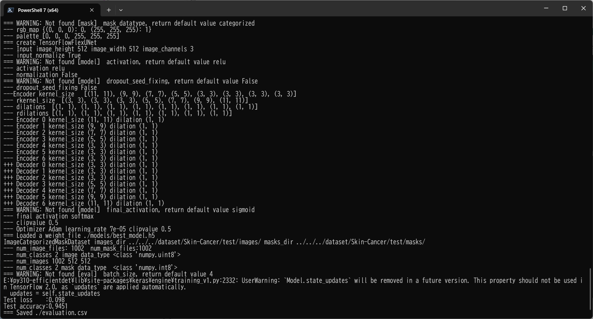
  Image-Segmentation-Skin-Cancer

<a href="./projects/TensorFlowFlexUNet/Skin-Cancer/evaluation.csv">evaluation.csv</a> 
The loss (categorical_crossentropy) to this Skin-Cancer/test was not low, and dice_coef_multiclass not high as shown below.
 
<pre>
categorical_crossentropy,0.098
dice_coef_multiclass,0.9451
</pre>
 
<h3>5 Inference</h3>
Please move to a <b>./projects/TensorFlowFlexUNet/Skin-Cancer</b> folder 
,and run the following bat file to infer segmentation regions for images by the Trained-TensorflowFlexUNet model for Skin-Cancer. 
<pre>
>./3.infer.bat
</pre>
This simply runs the following command.
<pre>
>python ../../../src/TensorFlowFlexUNetInferencer.py ./train_eval_infer.config
</pre>

<b>mini_test_images</b> 
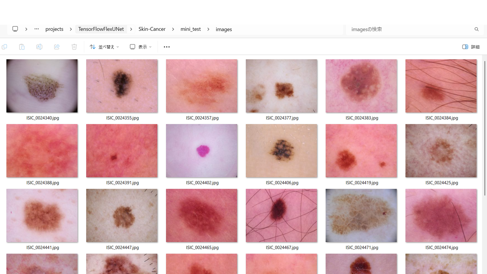 
<b>mini_test_mask(ground_truth)</b> 
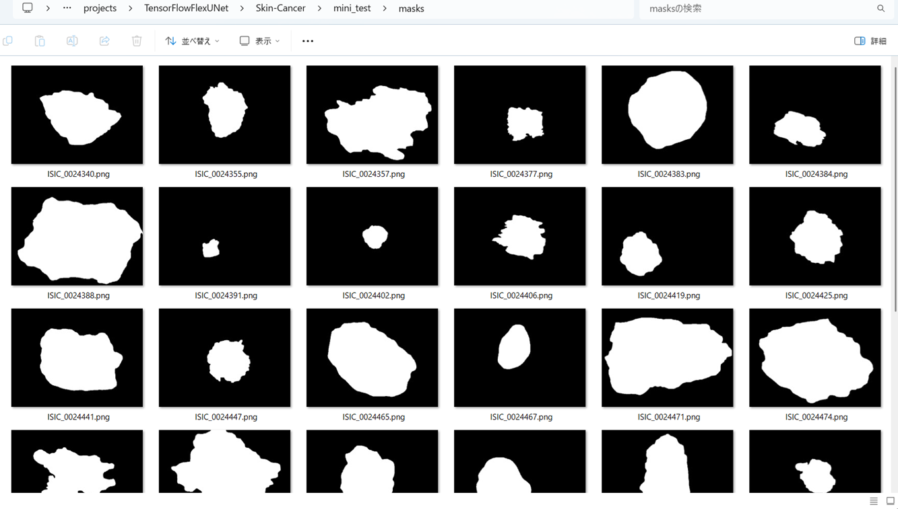 

<b>Inferred test masks</b> 
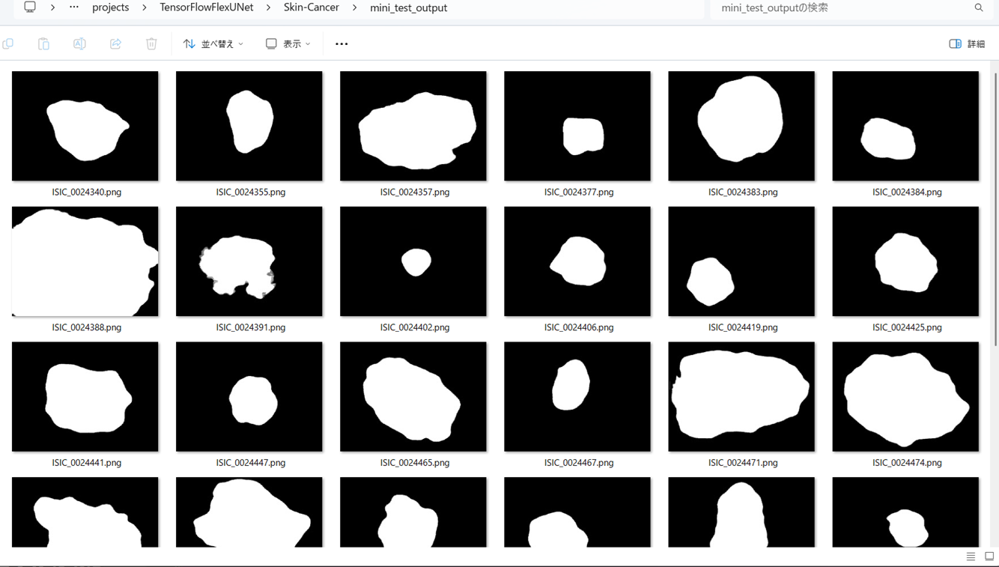 
 

<b>Enlarged images and masks for Skin-Cancer Images of  600x450 pixels</b> 
As shown below, the inferred masks predicted by our segmentation model trained by the dataset appear similar to the ground truth masks, but they lack precision in certain areas.
 
 
<table>
<tr>
<th>Input: image</th>
<th>Mask (ground_truth)</th>
<th>Prediction: inferred_mask</th>
</tr>
<tr>
<td></td>
<td></td>
<td>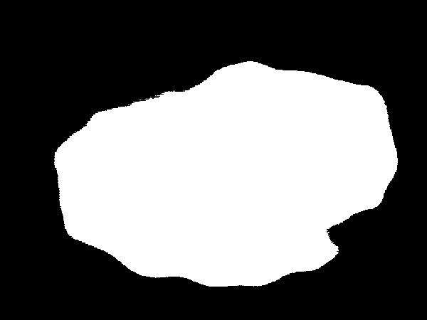</td>
</tr>

<tr>
<td></td>
<td></td>
<td></td>
</tr>

<tr>
<td></td>
<td></td>
<td>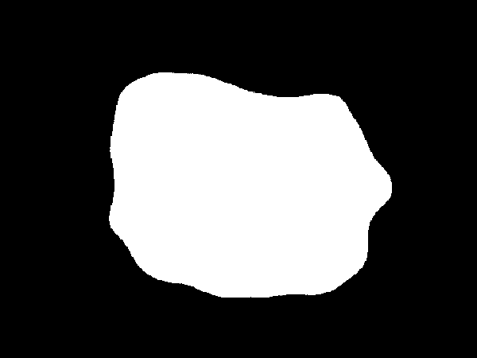</td>
</tr>
<tr>
<td></td>
<td></td>
<td>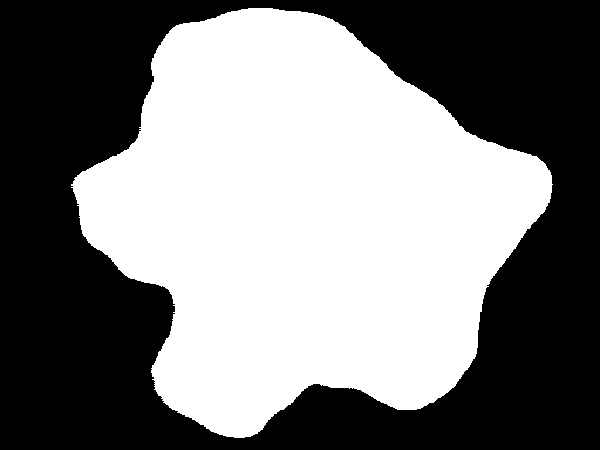</td>
</tr>
<tr>
<td></td>
<td></td>
<td>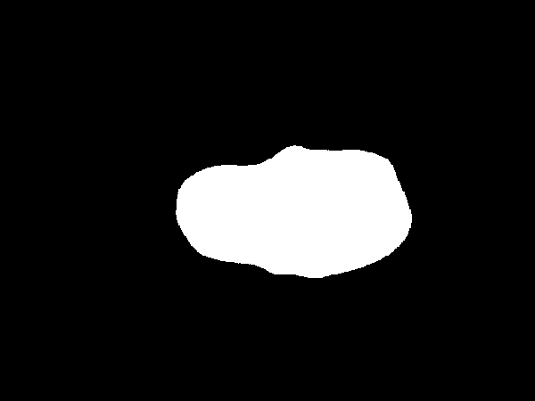</td>
</tr>
<tr>
<td></td>
<td></td>
<td></td>
</tr>
</table>

 
<h3>
References
</h3>
<b>1. ISIC 2017 - Skin Lesion Analysis Towards Melanoma Detection</b> 
Matt Berseth 
<a href="https://arxiv.org/ftp/arxiv/papers/1703/1703.00523.pdf">
https://arxiv.org/ftp/arxiv/papers/1703/1703.00523.pdf
</a>
  
<b>2. ISIC Challenge Datasets 2017</b> 
<a href="https://challenge.isic-archive.com/data/">
https://challenge.isic-archive.com/data/
</a>
  
<b>3. Skin Lesion Segmentation Using Deep Learning with Auxiliary Task</b> 
Lina LiuORCID,Ying Y. Tsui andMrinal MandalM 
<a href="https://www.mdpi.com/2313-433X/7/4/67">
https://www.mdpi.com/2313-433X/7/4/67
</a>
  
<b>4. Skin Lesion Segmentation from Dermoscopic Images Using Convolutional Neural Network</b> 
Kashan Zafar, Syed Omer Gilani, Asim Waris, Ali Ahmed, Mohsin Jamil, 
Muhammad Nasir Khan and Amer Sohail Kashif 
<a href="https://www.mdpi.com/1424-8220/20/6/1601">
https://www.mdpi.com/1424-8220/20/6/1601
</a>
  
<b>5.  Image-Segmentation-Skin-Lesion</b> 
Toshiyuki Arai  
<a href="https://github.com/sarah-antillia/Image-Segmentation-Skin-Lesion">
https://github.com/sarah-antillia/Image-Segmentation-Skin-Lesion</a>
  
<b>6. Tensorflow-Tiled-Image-Segmentation-Augmented-Skin-Cancer</b> 
Toshiyuki Arai  
<a href="https://github.com/sarah-antillia/Tensorflow-Tiled-Image-Segmentation-Augmented-Skin-Cancer">
Tensorflow-Tiled-Image-Segmentation-Augmented-Skin-Cancer
</a>
 
 
<b>7. TensorFlow-FlexUNet-Image-Segmentation-Model</b> 
Toshiyuki Arai  
<a href="https://github.com/sarah-antillia/TensorFlow-FlexUNet-Image-Segmentation-Model">
TensorFlow-FlexUNet-Image-Segmentation-Model
</a>
 
 
